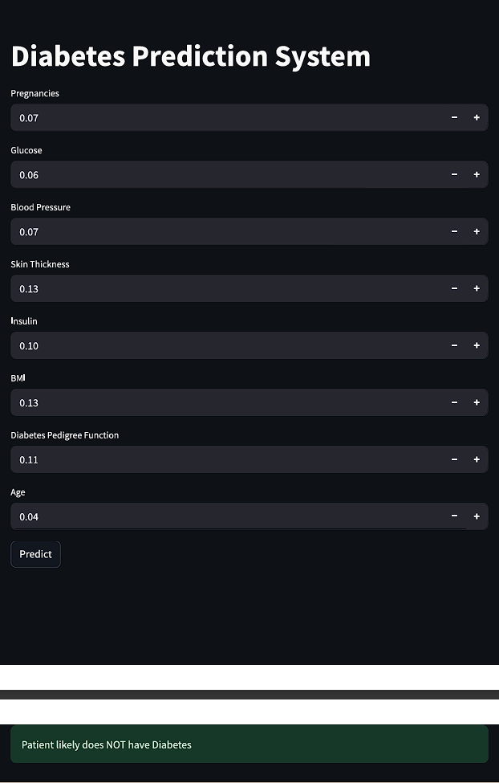

# Logistic Regression Assignment

## Objective
Build a Logistic Regression model for binary classification and deploy using Streamlit.

---

## Technologies Used
- Python
- Pandas
- NumPy
- Scikit-learn
- Streamlit

---

## Files Included
- Logistic Regression.ipynb
- app.py
- model.pkl
- diabetes.csv

---

## Model Deployment
The Logistic Regression model was deployed using Streamlit.

---

## Deployment Screenshot

